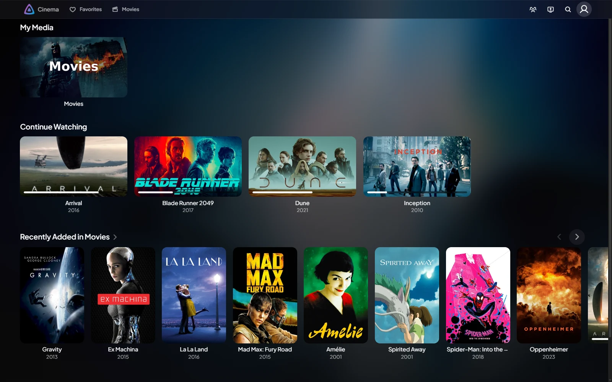
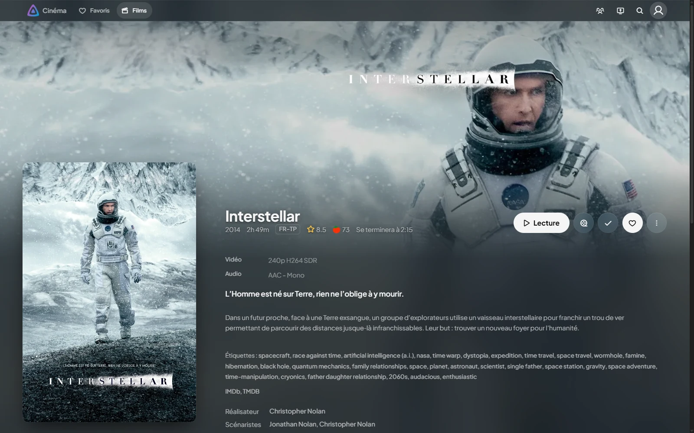
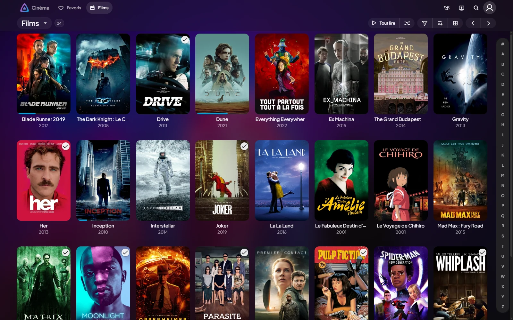
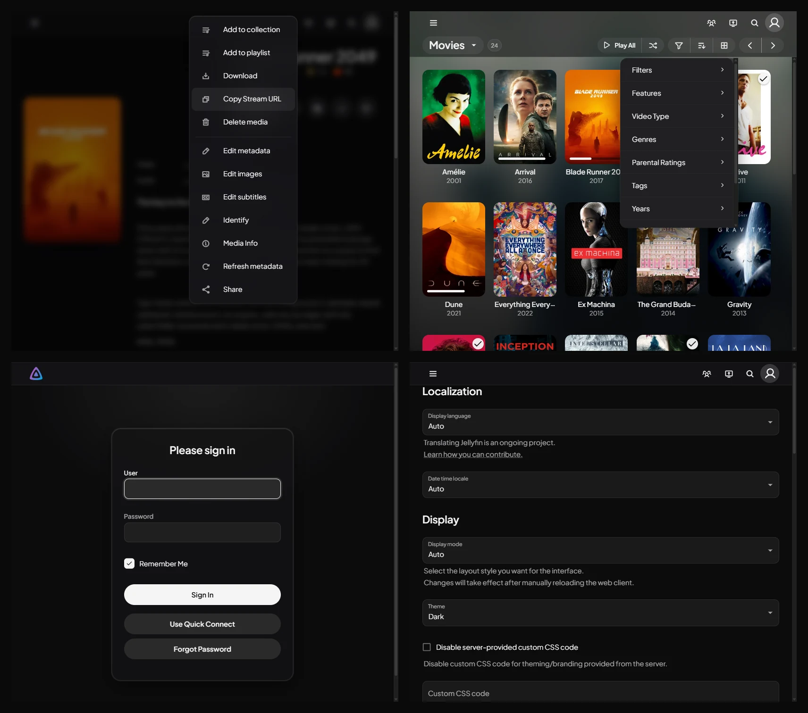
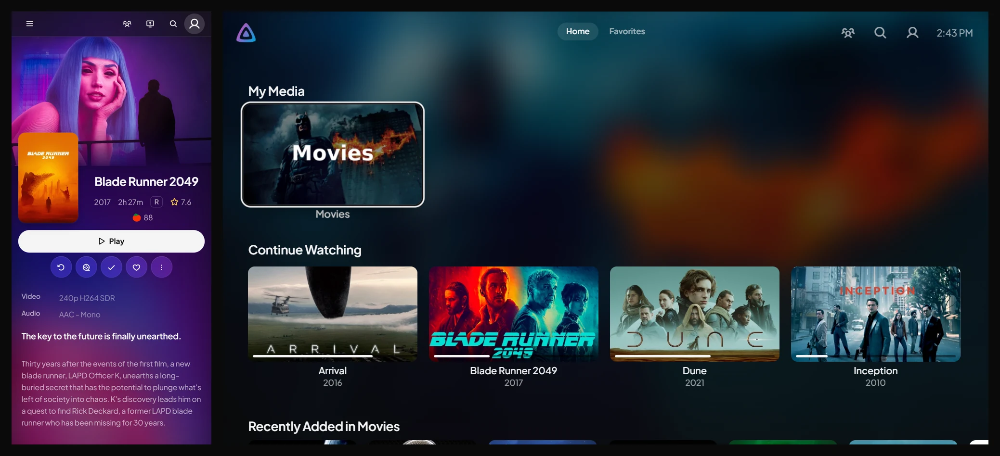

# Jellyfin Theme

**English** · [Français](README.fr.md)

A dark theme for Jellyfin 12, **Modern** layout. Neutral surfaces, white as
the action color, frosted glass, [Phosphor](https://phosphoricons.com) icons,
Plus Jakarta Sans. It covers the whole app: navigation, item page, login,
preferences, dialogs and menus, player, TV layout, and the admin dashboard.

One CSS file, one line to paste: `dist/theme.css`.

## Preview

### Home

Rows, a glass header, cards that lift on hover.



### Item page

Sharp hero, round buttons, a readable details sheet.



### Library

Cards, "watched" badges, progress bars, alphabet index.



### Menus, filters, login and preferences

One design for the client's legacy components and for MUI's.



### Mobile and TV



<sub>Screenshots taken on a test Jellyfin 12.1 server (English UI). Posters and artwork: © their respective owners, via TMDb.</sub>

## Installation

Dashboard → General → **Custom CSS**, a single line:

```css
@import url('https://cdn.jsdelivr.net/gh/matqueme/jellyfin-theme@v3.1.8/dist/theme.css');
```

Then `Ctrl+F5` in the client. The `@import` must stay the first thing in the
field: the browser ignores an `@import` placed after a rule.

For the blurred artwork behind pages (as in the screenshots), turn on
**Backdrops** in each user's display preferences.

### Dashboard

In 12, the client applies the branding CSS **to the user app only**: the
component that injects the `<style>` tag is not mounted in the dashboard
layout. To have the admin area follow the theme, install
[`js/theme-dashboard.js`](js/theme-dashboard.js) with the JavaScript Injector
plugin:

```bash
./apply-js.sh js/theme-dashboard.js
```

The script does not contain the theme: on `#/dashboard` pages it loads the
stylesheet the server already serves at `/Branding/Css`, and removes it when
leaving. Updating the branding CSS is therefore enough to update the
dashboard.

### Without network access

If clients must work without Internet access, `apply-local.sh` writes the file
straight into the server's `branding.xml`. See
[Development](docs/development.md). Only the fonts (Plus Jakarta Sans,
Phosphor) and the Phosphor SVGs used for MUI icons are still loaded from a CDN.

> Branding CSS applies to the web client and to clients that embed it
> (browser, desktop app, Android TV in web mode). Native clients, such as Roku
> or the native Android app, do not read it.
>
> The Samsung (Tizen) app does read the branding CSS, but it embeds its own web
> client, frozen at build time (10.11 for app 1.1.0), in TV layout: it is not
> the server's 12 client. `src/80-tv.css` covers that case: no frosted glass
> (too heavy for a TV), a sharp hero on the item page, adapted header and
> focus.

## Compatibility

| Theme | Jellyfin | Base |
|---|---|---|
| `v3.1.2` to `v3.1.8` | 12.x, Modern layout (+ Samsung app, 10.11 client) | none |
| `v3.0.0` to `v3.1.1` | 12.x, Modern layout | none |
| `v2.0.0` | 12.x | [Ultrachromic `1398af2`](https://github.com/CTalvio/Ultrachromic/tree/1398af21b8fe120a972bd00942ad60a76a932647) |
| `v1.3.0` | 10.11.x | [Ultrachromic `fa158a2`](https://github.com/CTalvio/Ultrachromic/tree/fa158a241cb24298c9996af3cf6460ae2f9d522f) |

The theme follows its own semver; the targeted Jellyfin version is
compatibility data, carried by this table and by each release's title. Every
version stays available through its tag: for Jellyfin 10.11, import `@v1.3.0`
instead of the current version in the installation URL.

The Legacy layout has not been targeted since v3. It remains usable, but its
header and drawer are not themed.

## Customize

All values (backgrounds, text, radii, glass, card hover, icon size, the Play
button label…) are tokens, defined in a single place:
[`src/01-tokens.css`](src/01-tokens.css). See
[docs/customization.md](docs/customization.md) for the list.

## Contribute

Module structure, build, releasing a version and the pitfalls found along the
way: [docs/development.md](docs/development.md).

## Credits

- [Phosphor Icons](https://phosphoricons.com): MIT license.
- [Plus Jakarta Sans](https://fonts.google.com/specimen/Plus+Jakarta+Sans) font: SIL OFL 1.1.
- Versions 1.x and 2.x were built on [Ultrachromic](https://github.com/CTalvio/Ultrachromic),
  by CTalvio (MIT). v3 contains none of it.

Code in this repository is under the [MIT](LICENSE) license.
